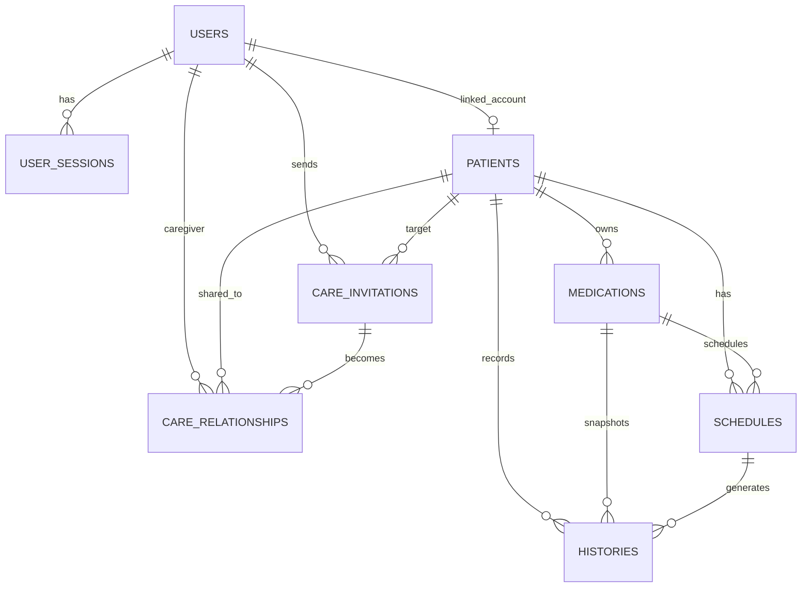
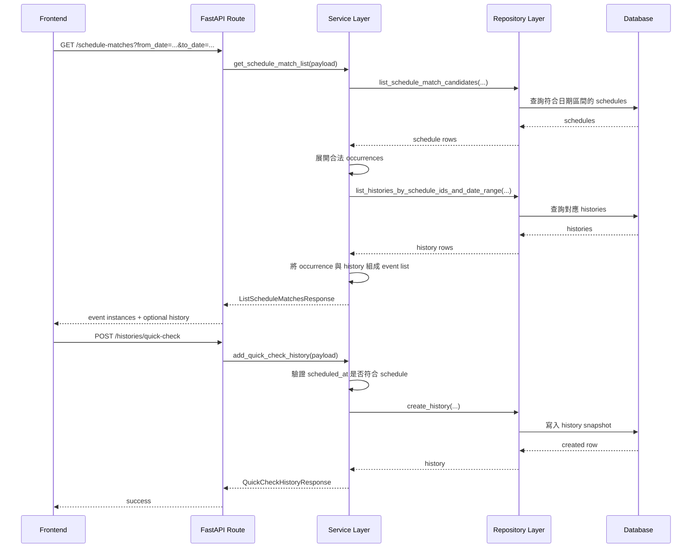

# Medi Check Backend

Medi Check Backend 是一個以 FastAPI 為核心的後端服務，負責處理用藥追蹤相關功能，包含：

- 使用者註冊、登入、登出與 refresh token session
- 病患管理
- 藥物管理
- 用藥排程管理
- 服藥紀錄與 quick check
- 照護邀請與照護關係

整體專案採用分層設計，讓 HTTP、商業邏輯與資料存取可以分開維護：

- `app/api/routes`：路由層，處理 HTTP request / response
- `app/services`：服務層，處理商業邏輯、權限驗證與交易流程
- `app/repositories`：資料存取層，負責 SQLAlchemy 查詢
- `app/models`：資料表模型
- `app/schemas`：Pydantic request / response schema
- `migrations`：Alembic migration

## 技術棧

- Python 3.14+
- FastAPI
- SQLAlchemy 2.x
- Alembic
- Pydantic v2
- `uv`

## 專案啟動

### 1. 安裝依賴

```bash
uv sync
```

如果你也需要開發工具，例如 Ruff、Pytest、Pyright：

```bash
uv sync --group dev
```

### 2. 準備資料庫

目前專案預設使用 SQLite，本機設定寫在 app/db/session.py。

目前預設值：

```python
DATABASE_URL = "sqlite:///./app.db"
```

執行 migration：

```bash
uv run alembic upgrade head
```

執行後會建立或更新本機的 `app.db`。

### 3. 啟動開發伺服器

```bash
uv run uvicorn app.main:app --reload
```

啟動後可使用：

- API：`http://localhost:8000`
- Swagger UI：`http://localhost:8000/docs`
- ReDoc：`http://localhost:8000/redoc`
- Health Check：`http://localhost:8000/health`

### 4. 常用開發指令

Lint：

```bash
uv run ruff check .
```

測試：

```bash
uv run pytest
```

重新產生 OpenAPI YAML：

```bash
uv run python scripts/generate_swagger.py
```

## 專案結構

```text
app/
  api/routes/         # HTTP 路由
  core/               # 安全、例外處理、共用工具
  db/                 # SQLAlchemy Base / Session
  dependencies/       # FastAPI dependency
  models/             # 資料表模型
  repositories/       # DB query
  schemas/            # Pydantic schema
  services/           # 商業邏輯
migrations/           # Alembic migration
scripts/              # 輔助腳本
swagger.yaml          # 匯出的 OpenAPI 文件
```

## 資料庫設計

### 設計核心

這個系統主要圍繞三件事：

- 身分與登入 session
- 病患與照護關係
- 用藥排程與實際服藥紀錄

其中最重要的設計分離是：

- `schedules`：定義「應該何時吃藥」
- `histories`：記錄「那次事件實際有沒有吃」

這個分離能讓排程規則保持乾淨，同時保留完整的歷史快照。

### 主要資料表

#### `users`

儲存系統使用者帳號。

主要欄位：

- `id`
- `email`
- `password_hash`
- `name`
- `avatar_url`
- `is_email_verified`
- `status`

#### `user_sessions`

儲存 refresh token 對應的 session。

主要欄位：

- `user_id`
- `token_id`
- `refresh_token_hash`
- `user_agent`
- `ip_address`
- `expires_at`
- `revoked_at`

這張表負責支援：

- 登入後建立 session
- refresh token 輪替
- 登出時撤銷 session

#### `patients`

代表被照護者。病患可以綁定使用者帳號，也可以只是單純的病患資料。

主要欄位：

- `linked_user_id`
- `name`
- `birth_date`
- `avatar_url`

目前註冊流程中，使用者註冊成功後會自動建立一筆 linked patient。

#### `care_invitations`

代表照護邀請流程中的邀請單。

主要欄位：

- `inviter_user_id`
- `invitee_email`
- `invitee_user_id`
- `patient_id`
- `invitation_type`
- `permission_level`
- `status`

這張表處理的是「關係建立前」的邀請階段。

#### `care_relationships`

代表已建立的照護關係，也是主要的權限依據之一。

主要欄位：

- `caregiver_user_id`
- `created_by_user_id`
- `patient_id`
- `invitation_id`
- `permission_level`
- `status`
- `revoked_at`

#### `medications`

代表病患名下的藥物。

主要欄位：

- `patient_id`
- `name`
- `dosage_form`
- `note`

#### `schedules`

代表藥物排程規則。

主要欄位：

- `patient_id`
- `medication_id`
- `timezone`
- `start_date`
- `time_slots`
- `amount`
- `dose_unit`
- `frequency_unit`
- `interval`
- `weekdays`
- `end_type`
- `until_date`
- `occurrence_count`

補充：

- `time_slots` 是 JSON 陣列，例如 `["08:00", "20:00"]`
- recurrence 規則由 `frequency_unit`、`interval`、`weekdays` 組成
- 結束條件由 `end_type`、`until_date`、`occurrence_count` 控制

#### `histories`

代表某一次具體的服藥事件結果。

主要欄位：

- `patient_id`
- `schedule_id`
- `medication_id`
- `scheduled_at_snapshot`
- `intake_at`
- `status`
- `source`
- `taken_amount`
- `memo`
- `feeling`
- `amount_snapshot`
- `dose_unit_snapshot`
- `medication_name_snapshot`
- `medication_dosage_form_snapshot`

這張表是 snapshot 導向設計。也就是說，就算之後藥物名稱、劑量形式、排程規則被修改，歷史紀錄仍然能保留當時的真實資訊。

### 資料表關係圖



### 為什麼 `schedule` 和 `history` 要分開

這是整個系統最重要的設計之一。

`schedules` 描述的是規則：

- 哪個病患
- 哪個藥物
- 什麼時候該吃
- 一次幾顆或幾單位
- 用什麼 recurrence 規則

`histories` 描述的是結果：

- 這次有沒有吃
- 什麼時間吃
- 實際吃了多少
- 使用者有沒有補 memo 或 feeling

這樣做有幾個好處：

- 排程規則可以獨立維護
- 歷史紀錄不會因為主資料變更而失真
- 前端可以直接拿 event state，而不是自己拼邏輯

## API 資料流

### 後端內部處理流程

1. Route layer 接收 request，轉成 payload schema。
2. Service layer 做驗證、權限判斷與商業邏輯。
3. Repository layer 執行資料查詢或寫入。
4. Service layer 整理 response。
5. Route layer 用 `success_response(...)` 包成統一回傳格式。

### 認證流程

相關路由：

- `POST /auth/sign-up`
- `POST /auth/sign-in`
- `POST /auth/refresh`
- `POST /auth/logout`

流程摘要：

1. 使用者註冊時建立 `users`。
2. 同時建立一筆對應的 `patients`。
3. 建立 `user_sessions`，保存 hash 過的 refresh token。
4. 回傳 access token，並透過 cookie 設定 refresh token。
5. refresh 時會撤銷舊 session，建立新 session。
6. logout 時會將 session 標記為 revoked。

重要分工：

- access token：前端呼叫受保護 API 時帶上
- refresh token：放在 cookie，後端對照 `user_sessions`

### 病患與照護流程

相關路由：

- `GET /patients`
- `POST /patients`
- `GET /patients/{patient_id}`
- `GET /care-invitations`
- `POST /care-invitations/me/caregiver`
- `POST /care-invitations/me/patient`
- `POST /care-invitations/{invitation_id}/accept`
- `POST /care-invitations/{invitation_id}/decline`
- `POST /care-invitations/{invitation_id}/revoke`
- `GET /care-relationships`

流程摘要：

1. 使用者建立或持有病患資料。
2. 其他使用者可透過 invitation 進入照護流程。
3. invitation 被接受後，形成 `care_relationships`。
4. 後續病患、藥物、排程、歷史紀錄的讀寫，都會依照 patient access / medication access 驗證。

### 藥物流程

相關路由：

- `GET /medications`
- `GET /patients/{patient_id}/medications`
- `POST /patients/{patient_id}/medications`
- `GET /medications/{medication_id}`
- `PATCH /medications/{medication_id}`
- `DELETE /medications/{medication_id}`

流程摘要：

1. 病患底下可以建立多筆藥物。
2. 藥物 CRUD 會先檢查病患或藥物存取權限。
3. 後續排程會依附在藥物之下。

### 排程流程

相關路由：

- `GET /schedules`
- `GET /schedules/{schedule_id}`
- `POST /medications/{medication_id}/schedules`
- `PATCH /schedules/{schedule_id}`
- `DELETE /schedules/{schedule_id}`
- `GET /schedule-matches`

這裡要特別分成兩種概念：

- schedule rule：排程規則本身
- schedule event：某一天實際展開後的事件

現在的 `GET /schedule-matches` 已經不是單純回 schedule rule，而是回傳某個日期區間內展開後的 event instance，並附帶對應的 history 狀態。

也就是說，前端不需要自己：

- 驗 recurrence 規則
- 判斷那一天是否真的有 event
- 自己 merge history

後端會直接回傳類似這種事件資料：

- `schedule_id`
- `scheduled_at`
- `patient_id`
- `patient_name`
- `medication_id`
- `medication_name`
- `medication_dosage_form`
- `amount`
- `dose_unit`
- `history`

### 服藥紀錄流程

相關路由：

- `GET /histories`
- `GET /histories/{history_id}`
- `POST /histories/quick-check`
- `PATCH /histories/{history_id}`

流程摘要：

1. `schedules` 定義某個排程何時應該發生。
2. 前端透過 `GET /schedule-matches` 取得某天的 event instances。
3. 使用者確認吃藥後，送出 `POST /histories/quick-check`。
4. 後端驗證 `scheduled_at` 是否真的是合法排程事件。
5. 建立一筆 `histories`，並把當下排程與藥物資料存成 snapshot。
6. 後續若要補 memo、feeling、taken_amount，走 `PATCH /histories/{history_id}`。

### 主要 API 流程圖

下面這張圖描述的是日常使用中最重要的一段流程：從排程規則，到 event 展開，到 quick check 建立 history。



### 一個完整生命週期

從新使用者到每日紀錄，大致會經過這個流程：

1. 使用者註冊。
2. 後端建立 `users`、`patients`、`user_sessions`。
3. 使用者為病患建立藥物。
4. 使用者為藥物建立排程。
5. 前端用 `GET /schedule-matches` 取得某一天的事件。
6. 後端展開事件並附上 history 狀態。
7. 使用者點 quick check。
8. 後端建立一筆 `history` snapshot。
9. 之後再次查詢 `GET /schedule-matches`，同一事件就會帶著 `history` 回來。

## Migration

專案使用 Alembic 管理資料庫 schema。

常用指令：

```bash
uv run alembic upgrade head
uv run alembic revision --autogenerate -m "describe change"
```

Alembic 會使用 `app.db.base.Base.metadata` 做 autogenerate。

## API 文件

- Swagger UI：`/docs`
- ReDoc：`/redoc`


重新產生：

```bash
uv run python scripts/generate_swagger.py
```
