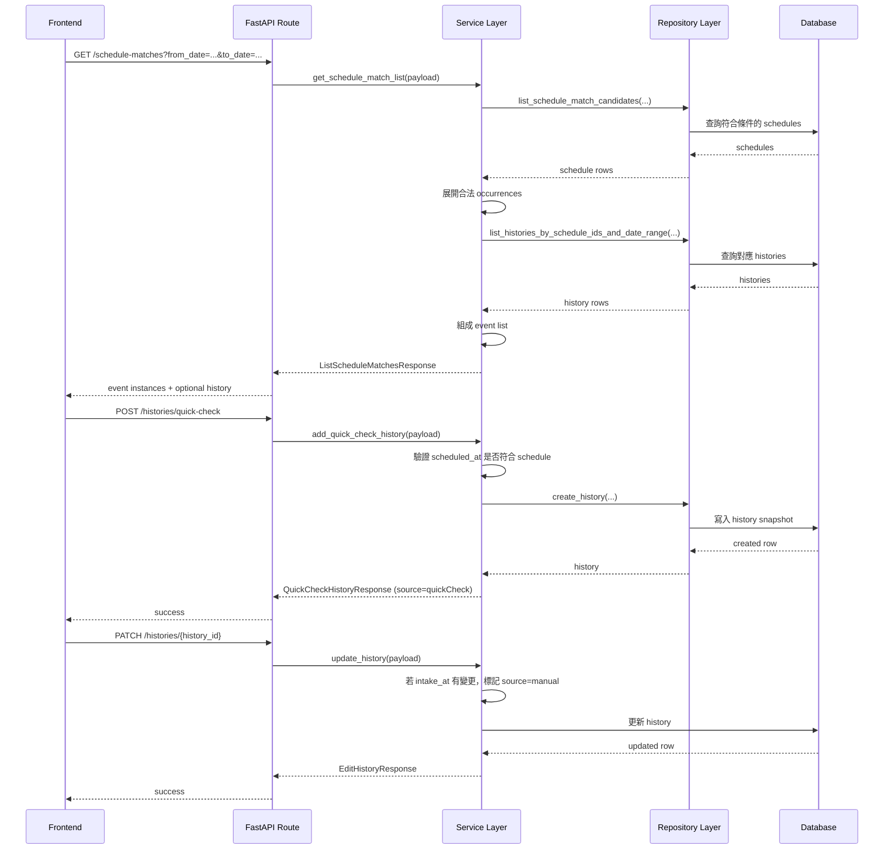

# API 資料流

## 總覽

這份文件描述的是主要 API 如何在前端、route、service、repository、database 之間流動。

大多數 API 都遵循這個模式：

1. Route layer 收 request
2. Route layer 建 payload
3. Service layer 驗證與執行商業邏輯
4. Repository layer 查詢或寫入 DB
5. Service layer 組出 response
6. Route layer 包成 API response

## 認證流程

相關路由：

- `POST /auth/sign-up`
- `POST /auth/sign-in`
- `POST /auth/refresh`
- `POST /auth/logout`

### Sign-up

1. 建立 `users`
2. 自動建立 linked `patients`
3. 建立 `user_sessions`
4. 回傳 access token
5. 將 refresh token 放入 cookie

### Sign-in

1. 依 email 找到 user
2. 驗證 password
3. 建立新 `user_sessions`
4. 回傳 access token
5. 設定 refresh token cookie

### Refresh

1. 從 cookie 取 refresh token
2. 解析 token id 與 user id
3. 對照 `user_sessions`
4. 撤銷舊 session
5. 建立新 session
6. 回傳新的 access token / refresh token

### Logout

1. 找到目前的 `user_sessions`
2. 將 `revoked_at` 設定為現在時間

## 病患與照護流程

相關路由：

- `GET /patients`
- `POST /patients`
- `GET /patients/{patient_id}`
- `GET /care-invitations`
- `POST /care-invitations/me/caregiver`
- `POST /care-invitations/me/patient`
- `POST /care-invitations/{invitation_id}/accept`
- `POST /care-invitations/{invitation_id}/decline`
- `POST /care-invitations/{invitation_id}/revoke`
- `GET /care-relationships`

流程摘要：

1. 使用者持有病患資料。
2. 若需共享病患，先建立 `care_invitations`。
3. invitation 被接受後，建立或啟用 `care_relationships`。
4. 之後病患、藥物、排程、歷史紀錄的存取都會經過權限驗證。

## 藥物流程

相關路由：

- `GET /medications`
- `GET /patients/{patient_id}/medications`
- `POST /patients/{patient_id}/medications`
- `GET /medications/{medication_id}`
- `PATCH /medications/{medication_id}`
- `DELETE /medications/{medication_id}`

流程摘要：

1. 病患建立藥物
2. service 驗證 patient / medication access
3. repository 寫入或查詢 `medications`
4. response 回傳 patient 與 medication 顯示資訊

## 排程流程

相關路由：

- `GET /schedules`
- `GET /schedules/{schedule_id}`
- `POST /medications/{medication_id}/schedules`
- `PATCH /schedules/{schedule_id}`
- `DELETE /schedules/{schedule_id}`
- `GET /schedule-matches`

### Schedule rule 與 event instance 的差別

這裡要特別區分：

- schedule rule：排程規則本身
- event instance：某一天展開後的具體事件

目前 `GET /schedule-matches` 回傳的是 event instance，而不是單純的 schedule rule。

這對前端的好處是：

- 不需要自己驗 recurrence
- 不需要自己判斷 event 合法性
- 不需要自己 merge history

## History 流程

相關路由：

- `GET /histories`
- `GET /histories/{history_id}`
- `POST /histories/quick-check`
- `PATCH /histories/{history_id}`

### Quick check 的實際流程

1. 前端先呼叫 `GET /schedule-matches` 取得某天 event instances
2. 使用者對某個 event 做 quick check
3. 前端送出 `POST /histories/quick-check`
4. backend 驗證 `scheduled_at` 是否符合該 schedule
5. backend 建立 `histories`
6. `histories` 會保存對應 snapshot
7. `history.source` 會是 `quickCheck`
8. 下次查同一天 event 時，就會看到對應的 `history`

### 回應範例

`GET /histories` 與 `GET /histories/{history_id}` 會回傳類似這樣的資料：

```json
{
  "id": "3a2a0f4d-7d4f-4c56-9f1c-3e7f6c7ecf1d",
  "intake_at": "2026-04-18T09:32:00Z",
  "status": "taken",
  "taken_amount": 1,
  "source": "quickCheck",
  "patient_snapshot": {
    "id": "4f3c0c7e-6d6b-4c90-9c67-8f1d2b1f3a20",
    "name": "Amy"
  },
  "medication_snapshot": {
    "id": "1cadab8f-e9d6-471a-8fff-33e2f552b1a0",
    "name": "Vitamin C",
    "dosage_form": "tablet"
  },
  "schedule_snapshot": {
    "id": "0167823c-1e26-4aa3-b23f-9dc4f236dab0",
    "scheduled_at": "2026-04-18T09:30:00Z",
    "amount": 1,
    "dose_unit": "tablet"
  }
}
```

如果是手動補填 `intake_at`，`source` 會變成 `manual`。

### Manual 的實際流程

1. `history` 先由 quick check 或 background job 建立
2. 使用者之後補填或修正服藥時間
3. 前端送出 `PATCH /histories/{history_id}`
4. backend 更新 `intake_at`
5. 只要 `intake_at` 有變更，該筆 `history.source` 就會標成 `manual`
6. 其他欄位像 `memo`、`feeling`、`taken_amount` 只視為一般資訊更新

## 主要資料流圖



## 一個完整生命週期

1. 使用者註冊
2. 系統建立 `users`、`patients`、`user_sessions`
3. 使用者建立藥物
4. 使用者建立排程
5. 前端查詢 `GET /schedule-matches`
6. backend 回傳展開後 event 與 history 狀態
7. 使用者執行 quick check
8. backend 建立 `history`
9. 之後同一事件會以帶 `history` 的形式回來
