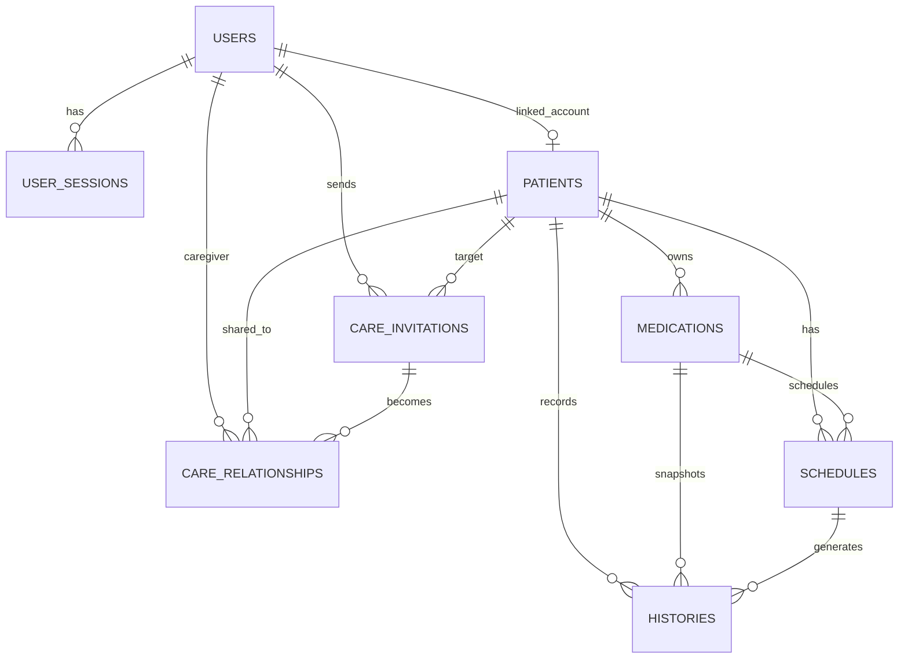

# 資料庫設計

## 設計核心

這個系統的資料模型主要圍繞三件事：

- 身分與登入 session
- 病患與照護關係
- 用藥排程與實際服藥紀錄

## 為什麼需要這些資料表

### `users`

`users` 存在的原因，是系統需要一個「可以登入、可以被驗證、可以持有 session」的主體。

它解決的是：

- 誰可以登入系統
- 誰擁有帳號層級的身份
- 誰可以發起照護邀請或接受邀請

如果沒有 `users`，系統就無法建立登入狀態、權限來源與照護協作的主體。

### `user_sessions`

`user_sessions` 存在的原因，是系統不能只靠 JWT access token 本身來管理長期登入狀態。

它解決的是：

- refresh token 的生命週期管理
- token 輪替
- 登出後撤銷 session
- 追蹤某個 session 是否已失效

如果只有 access token 而沒有 session table，後端很難安全地支援 refresh、撤銷與多裝置登入管理。

### `patients`

`patients` 存在的原因，是「被照護者」不一定等於「登入使用者」。

它解決的是：

- 使用者可以管理自己，也可以管理他人
- 病患可以是獨立資料，不一定要先有帳號
- 照護資料可以圍繞病患建立，而不是圍繞 user 建立

這是整個照護模型的核心。系統真正被管理的主體是 `patient`，不是 `user`。

### `care_invitations`

`care_invitations` 存在的原因，是照護關係不應該被直接建立，而需要一個中間的邀請流程。

它解決的是：

- 邀請尚未接受前，要有一個可以追蹤狀態的實體
- 系統需要知道誰邀請誰、邀請的是哪位病患、邀請要給什麼權限
- 邀請可能被接受、拒絕、撤銷或過期

如果沒有 invitation table，照護關係就會失去建立過程，也不容易處理審核與狀態轉換。

### `care_relationships`

`care_relationships` 存在的原因，是系統需要一個穩定的資料來源，來判斷誰對哪位病患有什麼權限。

它解決的是：

- caregiver 與 patient 之間的正式關係
- read / write / admin 等權限判斷
- 後續病患、藥物、排程、歷史紀錄的存取控制

換句話說，`care_invitations` 解決的是「關係如何建立」，而 `care_relationships` 解決的是「關係建立後如何被使用」。

### `medications`

`medications` 存在的原因，是系統需要一層獨立的藥物主資料，讓排程與歷史紀錄不必直接掛在病患底下。

它解決的是：

- 病患可能同時有多種藥物
- 每種藥物有自己的名稱、劑型與備註
- 後續排程應該依附在具體藥物，而不是直接依附病患

### `schedules`

`schedules` 存在的原因，是系統需要一個地方來描述「理論上應該何時吃藥」。

它解決的是：

- 每個藥物什麼時候該吃
- 每次應該吃多少
- 事件如何重複發生
- 規則何時結束

它描述的是規則，不是結果。

如果沒有 `schedules`，系統就只能記錄「吃了什麼」，卻無法回答「本來應該什麼時候吃」。

### 為什麼不直接產生 event，而是先存 `schedules`

乍看之下，也可以想像成系統在建立排程時，就直接把未來每天的 event 全部展開存進資料庫；但這個專案沒有這樣做，原因是 `schedule` 比 `event` 更適合當作主資料。

如果直接預先產生 event，會遇到幾個問題：

- 未來事件數量會快速膨脹，尤其是長期、每日、多時段的排程
- 只要規則有修改，就要重新生成、刪除或同步大量未來 event
- 很難清楚分辨「規則改了」和「某一次事件真的有被確認處理」
- 還沒發生的 event 本質上只是推導結果，不一定值得先落地成正式資料

相反地，把 `schedules` 當作規則來源，系統就可以在查詢時再動態展開 event instance。

這樣的好處是：

- 資料量比較穩定，不會因為長期排程而爆增
- 規則修改時，只要改 schedule 本身，不必大規模重建未來資料
- event 可以視為「由 schedule 推導出的讀取結果」
- 真正需要永久保存的，只有已經發生且被確認過的結果，也就是 `histories`

這種設計等於把資料切成兩層：

- `schedules`：可推導的規則層
- `histories`：必須保留的結果層

因此，系統不是不需要 event，而是選擇不把所有 event 都當成資料表中的主資料來存，而是在需要時由 `schedules` 展開，只有實際發生後才由 `histories` 留下紀錄。

### `histories`

`histories` 存在的原因，是排程規則本身不等於實際發生的行為。

它解決的是：

- 某次具體事件到底有沒有吃
- 實際在什麼時間吃
- 實際吃了多少
- 是否補充 memo 或 feeling
- 是否要保留當時的藥物與劑量快照

`histories` 是系統中最重要的結果資料。它讓系統可以把「應該發生」和「實際發生」分開建模。

另外，`histories.source` 也會記錄這筆結果是怎麼來的：

- `quickCheck`：使用者在排程事件上快速確認
- `manual`：使用者後來補填或修正 `intake_at`
- `system`：background job 自動補出的 missed history

## 最重要的設計分離：`schedule` 與 `history`

這個專案最關鍵的資料庫設計，不是單一資料表本身，而是 `schedules` 與 `histories` 的切分。

### `schedules` 處理的是規則

它回答的是：

- 這顆藥理論上何時該吃
- 這個規則如何重複
- 這個規則何時終止

### `histories` 處理的是結果

它回答的是：

- 這次事件到底有沒有發生
- 有沒有被確認為 taken 或 missed
- 當時的上下文是什麼

這樣分開之後，系統才能同時做好兩件事：

- 根據排程規則展開 event instance
- 保留每一次事件的實際紀錄

## 為什麼 `histories` 要用 snapshot 設計

`histories` 不是只存外鍵，而會保留當時的部分快照資訊。這樣做的目的，是避免歷史紀錄被現在的主資料污染。

它解決的是：

- 藥名後來改掉，舊紀錄不應該跟著變
- 劑型後來改掉，舊紀錄不應該失真
- 排程後來調整，舊紀錄仍應保留當時語境

也就是說，history 不是用來重建現在的資料，而是用來保留當時的事實。

## 資料表關係圖



## 關係說明

從系統視角來看：

- `user` 是登入與操作主體
- `patient` 是被管理與被照護的主體
- `medication` 是病患底下的藥物主資料
- `schedule` 是藥物的規則層
- `history` 是規則展開後的結果層
- `care_invitation` 是關係建立前的流程層
- `care_relationship` 是關係建立後的權限層

這個分層讓照護流程、排程規則與實際紀錄可以各自演進，不會互相混在一起。

## 設計上的實際好處

這種資料表拆法讓系統在實作上得到幾個直接好處：

- 權限可以穩定地從病患與照護關係出發判斷
- 排程規則可以被重複展開成 event，而不是硬存成大量靜態資料
- 歷史紀錄可以保留真實快照，不被後續修改污染
- 前端可以直接使用 backend 展開後的 event 結果，而不是自己重算規則

## Migration 說明

專案使用 Alembic 管理 schema 變更。

常用指令：

```bash
uv run alembic upgrade head
uv run alembic revision --autogenerate -m "describe change"
```

目前 migration 入口位於：

- migrations/env.py
- alembic.ini
